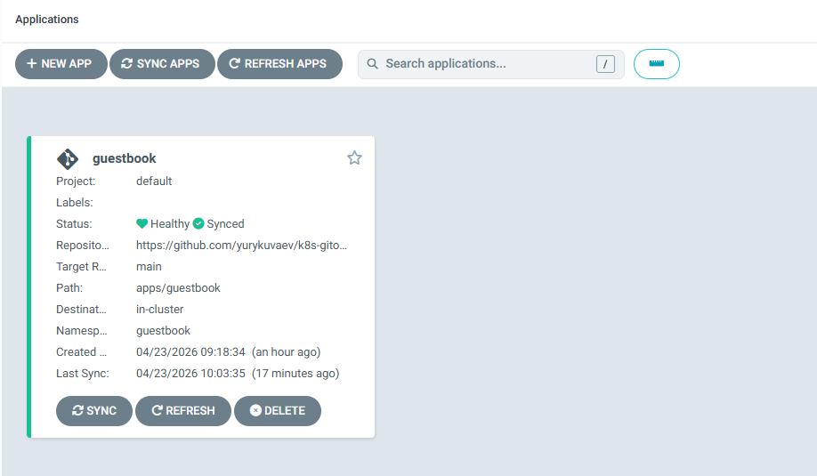
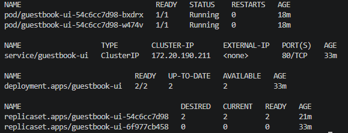

# 01 — EKS + ArgoCD (GitOps Foundation)

Production-pattern Amazon EKS cluster provisioned via Terraform, with ArgoCD deployed as the GitOps engine for declarative application delivery. This project establishes the foundation for all subsequent platform components (observability, service mesh, autoscaling) which will be deployed via the same GitOps workflow.

## Screenshots

### ArgoCD Application List


### ArgoCD Tree View — Full GitOps Sync


Notice the two ReplicaSets visible — `rev:2` (current, nginx) and `rev:1` (previous, heptio demo image). This shows the real-world debugging loop: the initial image was no longer available, so the fix was committed to Git, and ArgoCD rolled out the updated version.

### Cluster State Verification



## Architecture

```
GitHub: yurykuvaev/eks-platform-engineering          GitHub: yurykuvaev/k8s-gitops-apps
(infrastructure as code)                              (application manifests)
│                                                      │
│ terraform apply                                      │
▼                                                      │
┌────────────────────────────────────────┐             │
│  AWS EKS Cluster (k8s-lab, v1.30)      │             │
│  ┌──────────────────────────────────┐  │  watches &  │
│  │  ArgoCD (namespace: argocd)      │◄─┼──syncs──────┘
│  │  - application-controller        │  │
│  │  - repo-server                   │  │
│  │  - server (LoadBalancer)         │  │
│  └──────────────┬───────────────────┘  │
│                 │ applies manifests    │
│                 ▼                      │
│  ┌──────────────────────────────────┐  │
│  │  guestbook (namespace)           │  │
│  │  - Deployment (2 replicas)       │  │
│  │  - Service (ClusterIP)           │  │
│  └──────────────────────────────────┘  │
└────────────────────────────────────────┘
```

## What This Demonstrates

- **Infrastructure as Code:** Full EKS cluster reproducible from `terraform apply` — VPC, subnets, IAM roles, KMS encryption, OIDC provider for IRSA, managed node groups
- **GitOps workflow:** Application manifests live in a separate repo (`k8s-gitops-apps`), synced into cluster by ArgoCD
- **Self-healing:** ArgoCD `syncPolicy.automated.selfHeal: true` reverts manual `kubectl` changes back to Git state
- **Drift detection:** Manual `kubectl scale --replicas=5` was automatically reverted to `replicas: 2` as defined in Git
- **Separation of concerns:** Platform repo (infrastructure + ArgoCD config) kept separate from apps repo (workload manifests)

## Components Deployed

| Component | Version | Purpose |
|---|---|---|
| Amazon EKS | 1.30 | Managed Kubernetes control plane |
| Managed Node Group | t3.medium × 2 | Worker nodes |
| VPC | 10.0.0.0/16 | Network isolation, 3 AZs |
| KMS | AWS-managed CMK | EKS secrets encryption at rest |
| OIDC Provider | - | Foundation for IRSA in later projects |
| ArgoCD | 7.6.12 (Helm) | GitOps continuous delivery |

## Project Structure

```
01-eks-argocd/
├── terraform/
│   ├── main.tf              # VPC + EKS module + node group
│   ├── variables.tf         # Configurable inputs
│   ├── outputs.tf           # Cluster endpoint, kubeconfig command
│   └── versions.tf          # Provider versions
├── argocd/
│   └── applications/
│       └── guestbook.yaml   # ArgoCD Application watching k8s-gitops-apps
└── README.md
```

## Cost

Running cost: **~$0.20/hour** (EKS control plane $0.10/h + 2× t3.medium + LoadBalancer). Destroyed at end of each session via `terraform destroy`.

## Lessons Learned

### EKS nodes in public subnets require `map_public_ip_on_launch = true`
Without NAT Gateway (skipped for lab cost optimization), worker nodes must have public IPs to reach the EKS API endpoint and pull container images. The `terraform-aws-modules/vpc` module does not set this by default.

**Production alternative:** Private subnets with NAT Gateway (~$35/month) or VPC endpoints for AWS services (EKS, ECR, STS, S3) — more secure but adds cost and complexity.

### Container image availability is not guaranteed
Initially used `gcr.io/heptio-images/ks-guestbook-demo:0.2` which is no longer publicly pullable (403 Forbidden). Diagnosed via `kubectl describe pod` showing `ImagePullBackOff`.

**Production mitigation:** Mirror public images to a private registry (ECR), pin by SHA digest not tag, and alert on `kube_pod_container_status_waiting_reason{reason="ImagePullBackOff"}`.

### Two-repo GitOps structure
Infrastructure manifests (this repo) and application manifests (`k8s-gitops-apps`) are intentionally separated. This mirrors how platform and application teams own different concerns in production.

## Key Terraform Decisions

- **`terraform-aws-modules/eks`** community module used for speed and best practices (production-grade IAM, security groups, KMS). A from-scratch module will be built in Project 05 to demonstrate deep understanding.
- **`enable_irsa = true`** creates OIDC provider — prerequisite for IAM Roles for Service Accounts, needed in Project 04 (External Secrets Operator).
- **`enable_cluster_creator_admin_permissions = true`** uses the new EKS Access Entries API (2024) instead of the legacy `aws-auth` ConfigMap pattern.

## Reproducing This Project

### 1. Apply infrastructure

```powershell
cd terraform
terraform init
terraform apply -auto-approve
aws eks update-kubeconfig --region us-east-1 --name k8s-lab
```

### 2. Install ArgoCD

```powershell
kubectl create namespace argocd
helm repo add argo https://argoproj.github.io/argo-helm
helm install argocd argo/argo-cd --namespace argocd --version 7.6.12 `
  --set server.service.type=LoadBalancer --wait
```

### 3. Apply GitOps Application

```powershell
kubectl apply -f argocd/applications/guestbook.yaml
```

### 4. Verify

```powershell
kubectl get application -n argocd guestbook
kubectl get all -n guestbook
```

### Teardown

```powershell
kubectl delete application guestbook -n argocd
helm uninstall argocd -n argocd
cd terraform && terraform destroy -auto-approve
```
