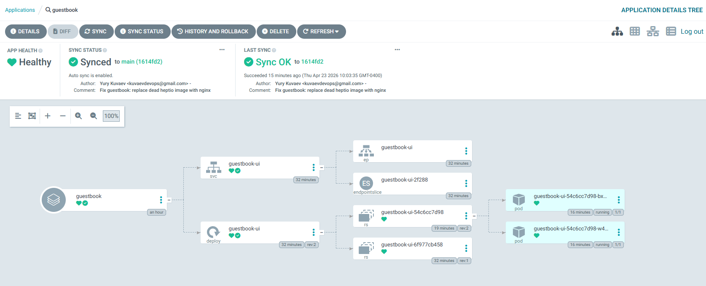

# EKS Platform Engineering

> Personal lab building a production-pattern Kubernetes platform on AWS — one capability at a time.

This repository is a hands-on portfolio of platform engineering work on **Amazon EKS**: Terraform-provisioned infrastructure, GitOps delivery with ArgoCD, and progressive additions of observability, service mesh, autoscaling, and secrets management. Each numbered folder is a self-contained project with its own Terraform, manifests, and write-up.

**Companion repo:** [`k8s-gitops-apps`](https://github.com/yurykuvaev/k8s-gitops-apps) — application manifests continuously reconciled by ArgoCD.

---

## Portfolio Roadmap

| # | Project | Focus | Status |
|---|---|---|---|
| 01 | [EKS + ArgoCD](./01-eks-argocd) | EKS cluster, GitOps foundation | **Complete** |
| 02 | Observability stack | Prometheus, Grafana, Loki via Helm + ArgoCD | Planned |
| 03 | Service mesh | Istio ambient mode, mTLS, traffic policies | Planned |
| 04 | Secrets & IRSA | External Secrets Operator + AWS Secrets Manager | Planned |
| 05 | Autoscaling | Karpenter node autoscaling, HPA, KEDA | Planned |
| 06 | From-scratch EKS module | Custom Terraform module (no community modules) | Planned |

---

## Tech Stack

**Cloud & infra** — AWS (EKS, VPC, IAM, KMS), Terraform 1.9+, `terraform-aws-modules`
**Kubernetes** — EKS 1.30, Helm, ArgoCD, Kustomize
**Planned** — Prometheus, Grafana, Loki, Istio, Karpenter, External Secrets Operator, KEDA
**Patterns** — GitOps, IaC, IRSA, least-privilege IAM, self-healing sync, drift detection

---

## Architecture (current state)

```
GitHub: yurykuvaev/eks-platform-engineering       GitHub: yurykuvaev/k8s-gitops-apps
(infrastructure as code)                           (application manifests)
|                                                   |
| terraform apply                                   | watched by ArgoCD
v                                                   |
+-------------------------------------+             |
|  AWS EKS Cluster (k8s-lab, v1.30)   |             |
|  VPC / 3 AZs / KMS / OIDC / IRSA    |             |
|                                     |             |
|  +--------------+  syncs from Git   |             |
|  |  ArgoCD      |<-------------------+-------------+
|  +------+-------+                   |
|         v                           |
|  [ workloads reconciled from Git ]  |
+-------------------------------------+
```

---

## Preview — Project 01



ArgoCD reconciling the `guestbook` application from Git, with a visible rollback history (`rev:1` → `rev:2`) from a real debugging session documented in the [Project 01 README](./01-eks-argocd/README.md#lessons-learned).

---

## What This Demonstrates

- **Infrastructure as Code** — entire platform reproducible from `terraform apply`; teardown via `terraform destroy`
- **GitOps delivery** — no manual `kubectl apply` in normal operation; Git is the source of truth
- **Separation of concerns** — platform repo (this) vs. application repo ([`k8s-gitops-apps`](https://github.com/yurykuvaev/k8s-gitops-apps))
- **Self-healing & drift detection** — manual changes in-cluster are reverted to the Git-declared state
- **Cost-aware lab design** — ~$0.20/hour, torn down between sessions; lessons learned documented alongside each project

---

## Running It

Each project is self-contained with its own README and `terraform apply` / `terraform destroy` flow. Start with [**Project 01 — EKS + ArgoCD**](./01-eks-argocd/README.md).

Prerequisites: AWS account, `aws` CLI, `terraform` ≥ 1.9, `kubectl`, `helm`.

---

## About

Built by [Yury Kuvaev](https://github.com/yurykuvaev) as a public, reproducible record of platform engineering work — Terraform, manifests, lessons learned, and real debugging screenshots instead of polished demos.

Contact: kuvaevdevops@gmail.com